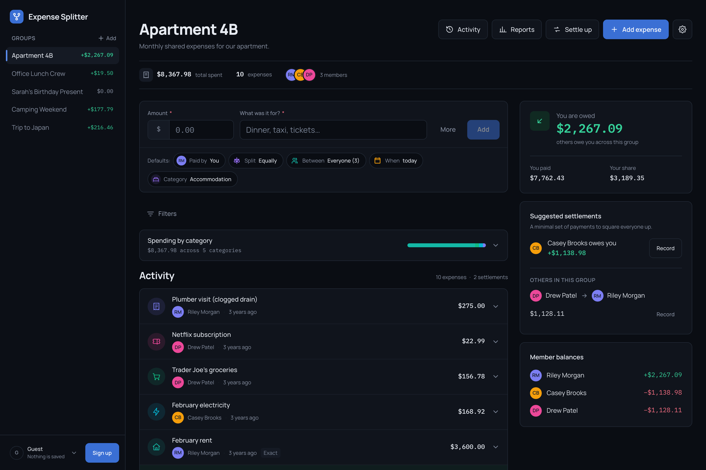

# Expense Splitter: Sarah Abuteen

A group expense-splitting app with multi-currency support, flexible split types, and clear settlement tracking.

**Challenge:** [Expense Splitter on Frontend Mentor](https://www.frontendmentor.io/challenges/expense-splitter)

**Live URL:** https://expense-splitter-khaki-psi.vercel.app



---

## Overview

A full-stack expense splitter built on Next.js 16 and Supabase. You create a group, add people by name, log what you paid, and the app keeps everyone's balance in the group's currency. Expenses can be split equally, by exact amounts, by percentage, or by shares; they can be logged in any of 35 currencies and are converted at the day's rate, stored with the expense so the balance never moves afterwards.

Two things shape the experience:

**Nobody needs an account to be in a group.** Members are names. Emails are optional and only matter if that person wants to sign in. This is how these groups actually work — one person tracks the trip and the other four never install anything.

**Visitors land inside a working app.** `/guest` opens five seeded groups with 43 expenses, mixed currencies, partial settlements, and rounding residues, all read from Supabase through the anonymous role. Write actions are visible and enabled, and stop at a sign-up prompt rather than being hidden or greyed out, so the product looks whole before you commit to it.

Balances, filtering, sorting, and aggregation all run in the database. The client receives one page of finished rows plus totals over everything that matched; it computes neither.

### Tech stack

| Layer | Technology |
|-------|-----------|
| Framework | Next.js 16.3 (App Router, Server Components), React 19.2 |
| Database | Supabase Postgres — 8 tables, SQL views for balances and totals, row-level security on every table |
| Authentication | Supabase Auth (email + password, forgot/reset), session refreshed in `proxy.ts` |
| Hosting | Vercel |
| Styling | Tailwind CSS v4, no config file — design tokens in `app/tokens.css`, exposed through `@theme inline` |
| Currency API | [ExchangeRate-API](https://www.exchangerate-api.com) v6, cached per base currency for 6 hours in a module-level map |
| Other | TypeScript strict, `node:test` + `tsx` for unit tests (58 tests), Lucide icons, Manrope / IBM Plex Sans Arabic / IBM Plex Mono |

---

## Design decisions

These are the product and design choices I made where the spec left room for interpretation.

### Expense entry UX

**The problem I was solving:**

Logging an expense is the thing people do most, often standing in a queue or splitting a bill at the table. Most of those expenses are boring: one person paid, split evenly, today. But the app also has to handle a hotel in yen split four ways by percentage. A form built for the second case makes the first case slow; a form built only for the first case can't do the job.

**My approach:**

An inline composer at the top of the group, not a modal and not a separate route. The fast path is two fields — amount and description — and an Add button. Everything else is stated as a row of chips reading the current defaults: *Paid by You*, *Split Equally*, *Between Everyone (3)*, *When today*, *Category Accommodation*. Each chip is a button that opens the full form with that section focused.

The amount is a joined control: the currency symbol is welded to the left of the field, so what you are typing and what currency it is in are one object.

**Why I chose this approach:**

Stating the defaults out loud does two jobs at once. It tells you what will happen if you just hit Add, and it shows you where to go if that's wrong — so the common case takes two fields, and the uncommon case takes one tap. Underlined words inside a sentence ("split *equally* between *everyone*") don't read as controls; a bordered chip showing a label and its value does.

Keeping it inline matters on mobile: a modal over a page you were already reading loses the context you were in, and cancelling it feels like a mistake to undo.

**What I'd do differently:**

The expanded form is one long column. With more time I'd group payer and split into a single step and let the category and date stay collapsed, so the expanded state is two decisions rather than five.

### Group dashboard design

**The problem I was solving:**

The dashboard has to answer two different questions at once: "where do I stand?" and "what has been happening?" Those want different shapes — a figure and a list — and cramming both into one column makes each worse.

**My approach:**

A two-column layout above `lg`: the activity ledger flexes, and a fixed detail rail holds your balance, the suggested settlements, and every member's position. Below `lg` the rail moves under the ledger. The sidebar is the group list — each row carries its own balance, so "where do I stand everywhere" is answered without navigating.

There is no group-list screen: `/groups` routes you into a group, or shows the empty state when there is nothing to route to.

**Why I chose this approach:**

"Where do I stand in this group" is the question people open the app to ask, so it gets a fixed position that never moves as the ledger grows. Putting each group's balance in the nav answers the broader version of the same question for free.

The dashboard has no max-width and no `mx-auto`: the sidebar already narrows the pane, and a second cap just reintroduces dead space.

**What I'd do differently:**

The activity list and the reports page overlap — both answer "where did the money go", one by row and one by shape. I'd fold the small category breakdown on the dashboard into the ledger's own header rather than carrying it as a separate card.

### Settlement flow design

**The problem I was solving:**

Simplified debts are the useful answer and the confusing one. "Pay Casey $40" is actionable, but Casey may be someone you never shared an expense with, and if the app doesn't explain that, it looks like a bug.

**My approach:**

The simplified plan leads, with the raw pairwise debts one tap away, and a sentence under each explaining what you're looking at. Recording a payment opens a dialog pre-filled with the suggested amount but editable, because partial payments are normal. The remainder updates live as you type, so paying a round number tells you what is left before you confirm.

**Why I chose this approach:**

I built it the other way round first — direct debts by default, on the argument that a verifiable view earns more trust. Testing against the seeded data showed why that's wrong: in a nearly-settled group, the direct view asks three people whose net balance is zero to pay each other in a circle. Suggestions are supposed to come from current balances, and asking a settled person to send money contradicts that.

Keeping the original debts available and explained is also the thing the incumbents get wrong: they hide simplification instead of showing their working.

**What I'd do differently:**

Recording a settlement is a single write with no undo beyond deleting it from the activity feed. A short-lived undo in the confirmation would be kinder than making someone find the row again.

### Other design choices

**Dark by default.** The palette is designed dark-first, so that is what a visitor sees before choosing anything. The root layout renders `data-theme="dark"` on `<html>` and a tiny inline script corrects it before first paint if you've saved light or system, so there's no flash. "System" stays a real, selectable third option rather than the initial state.

**Money is integers.** Every amount is stored and calculated in minor units. Conversions store the rate used on the expense itself, so a balance calculated last March still reconciles today.

**Rounding residues are shown, not swept away.** The settled threshold applies to *who takes part* in a settlement plan, not to individual payments — filtering small payments instead silently drops mid-plan residues and leaves someone permanently short. A payment that exists only because of rounding is labelled `rounding` rather than hidden.

**Guest mode is a client choice, not a code path.** Guests get a Supabase client with no session, so the anonymous role sees exactly the demo groups and nothing else. There is no `if (guest)` branching in the read layer, and RLS is the actual boundary.

**A readable URL for the demo.** The guest landing group lives at `/guest` rather than `/groups/<uuid>`. The redirect happens in `proxy.ts`, not in the page: by the time a Server Component can call `redirect()`, the shell has already streamed and Next degrades it to a visible `<meta refresh>` bounce.

---

## Development journey

### Initial approach vs. final

The plan was backend-first: schema, then APIs, then screens. What actually worked was building each feature end-to-end — expenses UI, then expenses backend, then integration — because the shape of the API kept changing once the screen existed.

The largest structural change came late: filtering, sorting, and derived values started in the client and moved to the server (`338285a`). Once a group had 43 expenses across two currencies, shipping the whole ledger to the browser to filter it there stopped being defensible.

### Decisions reconsidered

- **Settle-up defaults.** Direct pairwise debts led at first; simplified now leads, for the circular-debt reason described above.
- **Where expenses get created.** A modal, then a route, then the inline composer that shipped.
- **Balance filtering.** An early version dropped any payment under a currency unit, which quietly lost a 32¢ residue in the Camping Weekend group and left a member short. The threshold now decides who is in the plan, not which payments get emitted.
- **Sidebar landmarks.** The rails were unlabelled `<aside>` elements competing with the balance rail in the landmark list; they're now named.

### What surprised me

- How much of "financial accuracy" is *presentation*. The arithmetic is easy; deciding what a 32¢ residue means to a person, and saying so, is the hard part.
- How far native platform elements go. `<dialog>` + `showModal()` gives focus trapping, Escape, background inertness, and focus restoration for free — all four verified rather than assumed.
- Grid items default to `min-width: auto`, so a single-column grid on a phone refuses to be narrower than its own content. That one default was the entire cause of the dashboard's horizontal scroll at 375px.

### Session breakdown

Derived from the commit history.

| Session | Focus | What I Accomplished |
|---------|-------|-------------------|
| 1 (Aug 25) | Setup | Next.js 16 scaffold, Supabase project, schema and RLS, `.env` wiring, seed script |
| 2 (Aug 26, midday) | Auth + groups | Auth UI and API routes, colour palette and design tokens, group management UI and APIs |
| 3 (Aug 26, afternoon) | Expenses + settlements | Expense UI and backend, split types, settlements backend and UI, filtering, editing, custom categories |
| 4 (Aug 26, evening) | Server-side data + polish | Moved filtering/sorting/aggregation to the server, guest gate, account menu, settle page rework, landing page |
| 5 (Aug 26, night) | Reports + differentiators | Reports, CSV export, skeleton loading states, three charts, debt-simplification visual, activity feed, manual rate override, ledger pagination |
| 6 (Aug 27) | Quality pass | Landing page redesign, copy edits, dark as the default theme, `/guest` URL, responsive fixes, full accessibility implementation |

---

## AI collaboration reflection

<!-- TODO (yours to write — this section is about your experience, not the code).
     The sections below are the only ones left blank on purpose. -->

### How I used AI

<!-- What was AI most helpful for? Where did you rely on your own judgment? -->

### What worked well

<!-- Which prompting strategies or collaboration patterns produced the best results? -->

### What I learned

<!-- How did your approach to AI collaboration evolve across sessions? What would you do differently next time? -->

### Where I pushed back

<!-- Were there moments where AI suggestions weren't right? How did you identify and correct course? -->

---

## Differentiators

### Chosen differentiator(s)

**1. Debt simplification algorithm**

**Why I chose this:** It is the one place in this product where an algorithm makes a visible difference to a person's afternoon. Five payments becoming two is something you can feel.

**How it enhances the product:** The settle-up page leads with the minimal plan and keeps the original pairwise debts one tap away, each with a sentence explaining what you're looking at. A small before/after figure on the reports page makes the reduction tangible.

**Implementation highlights:**

- Greedy matching: repeatedly pair the largest debtor with the largest creditor (`lib/balances.ts`). The general problem is NP-hard; greedy is correct — every balance reaches zero — and never needs more than *n−1* payments, which is more than good enough for real group sizes. It is documented as greedy rather than optimal on purpose.
- Runs entirely on integer minor units, so the payments reconcile exactly.
- Edge cases covered by unit tests: circular debts, already-settled members, sub-unit residues, and members who are settled overall but appear in the direct view.
- The viewer's own payment is separated and its direction resolved server-side, so no component has to work out which side of a debt you're on.

**What I learned:** The correctness bar isn't "fewer payments" — it's "every balance reaches zero *and* nobody settled is asked to pay". Those pull against each other at the threshold, and the seeded data is what exposed it.

**2. Interactive data visualization**

**Why I chose this:** A ledger tells you what happened; a shape tells you whether it was normal.

**How it enhances the product:** The reports page carries spending over time, a category breakdown, and a stacked member-contribution chart, over a date range you choose, with CSV export of the underlying rows.

**Implementation highlights:**

- Hand-built SVG rather than a charting library — the whole reports payload is aggregated in Postgres, so the client only ever draws finished numbers.
- The categorical palette is validated for colour-vision deficiency: worst adjacent-pair ΔE is 9.1 in light and 8.4 in dark. The avatar hues were deliberately *not* reused, since violet and blue are indistinguishable under deuteranopia as adjacent marks.
- Every chart has a real `<table>` alternative with a caption, because several series sit below 3:1 against the surface.
- Direct labels on bars instead of an axis where the series count allows it.

**What I learned:** Choosing colours that survive colour-blindness is a constraint solver, not a taste exercise — and it's worth running the numbers rather than trusting a palette's reputation.

---

## Self-assessment

<!-- Ratings are yours to set — the Notes column records what's actually in the
     repo, so the numbers are yours to weigh against it. -->

| Category | Rating | Notes |
|----------|--------|-------|
| **Works for real users**: deployed, functional end-to-end | /5 | Deployed on Vercel with Supabase Postgres, auth, and RLS; guest mode needs no account |
| **Financial accuracy**: balances are correct, rounding is handled, currencies format properly | /5 | Integer minor units throughout; rates stored per expense; 58 unit tests over splits, balances, money, and booking |
| **Multi-currency handling**: API integration, rate caching, conversion display, formatting | /5 | 35 currencies, 6-hour rate cache, per-currency decimal places, manual rate override when the service is unreachable |
| **Design-it-yourself features**: quality and thoughtfulness of expense entry, dashboard, and settlement flow | /5 | Inline composer with stated defaults, two-column dashboard, simplified-first settle plan with the raw debts kept and explained |
| **Design quality**: typography, spacing, visual hierarchy, polish | /5 | Token-driven palette and type scale, one dialog implementation, one button definition, skeletons on every route |
| **Responsive design**: fully functional and well-designed across devices | /5 | Verified with no horizontal scroll at 320/375/768/1024 across all six app routes, plus drawer, dialogs, and 200% zoom |
| **Performance**: fast load, smooth interactions, efficient calculations | /5 | Server-side filtering, sorting and aggregation; set-based reads (no per-group fan-out); 25-row pagination; Lighthouse 99 |
| **Accessibility**: keyboard nav, screen reader support, contrast, currency announcements | /5 | See below — axe clean on 7 pages × 2 themes, Lighthouse accessibility 100 |
| **Edge case handling**: empty states, errors, rounding, mixed currencies, split validation | /5 | Rounding residues surfaced and labelled, currency locked once a group has expenses, split validation quotes the shortfall ("Currently: 95%") |
| **Code quality**: clean, maintainable, well-structured | /5 | Server reads in `lib/server`, pure calculation in `lib`, `server-only` guards, 18 API routes, comments record *why* not *what* |
| **Landing page**: compelling, communicates value, visually polished | /5 | Interactive split switcher, settlement graph, live app preview |
| **Guest experience**: immediately impressive, realistic data, full features | /5 | 5 groups, 43 expenses, mixed currencies, partial settlements, at `/guest` |

### Lighthouse scores

Lighthouse 12, desktop preset, against a production build (`npm run build && npm start`) of the current commit.

| Category | Score |
|----------|-------|
| Performance | 99 |
| Accessibility | 100 |
| Best Practices | 100 |
| SEO | 100 |

### Accessibility verification

The checklist in `guidance/accessibility.md` is implemented and verified, not just asserted:

- **axe-core** (WCAG 2.0/2.1/2.2 A + AA, plus best-practice): zero violations across 7 routes in both themes, and again on an open dialog and at 200% zoom.
- **Keyboard:** skip link is the first tab stop; 38 stops on the dashboard with no traps; every stop shows a focus ring; Escape closes dialogs and restores focus to the trigger.
- **Contrast:** every text pairing meets AA — including a separate accent *fill* token, because the accent that reads well against a dark page carries white text at only 3.23:1.
- **Screen reader:** one polite live region in the shell announces settlement and expense confirmations, since the dialog that caused them has closed by the time they land. Balance figures carry full spoken context ("You are owed $2,267.09 across this group") rather than a bare number whose direction lives in colour.
- **Motion:** all animation is declared inside `prefers-reduced-motion: no-preference`, verified as fully still under `reduce`.

### Strengths

The parts I'd point at: balances that stay correct through mixed currencies, partial settlements, and rounding — with the awkward cases surfaced instead of hidden; a settle-up flow that shows its working; and an accessibility pass that is measured rather than claimed.

### Areas for improvement

- Recurring expenses exist in the schema and the seed data but have no UI (see limitations).
- The reports page and the activity ledger answer overlapping questions and should be consolidated.
- No end-to-end tests — the 58 unit tests cover calculation, not flows.

---

## Known limitations

- **Recurring expenses (Core #13) are data-only.** The `recurrence` column and seeded monthly rent/subscriptions exist, but there is no UI to create, pause, edit, or auto-generate them, and no badge on recurring rows.
- **No screen-reader testing on real assistive technology.** Everything is verified with axe, Lighthouse, and scripted keyboard runs; VoiceOver/NVDA passes are still outstanding.
- **Beyond-AA accessibility items not built:** customisable font size, a high-contrast mode, spelled-out amount announcements ("forty-five dollars"), and a global quick-entry keyboard shortcut.
- **Charts can't be exported as images,** and there's no balance-history-over-time chart — both are optional sub-items of the visualization differentiator.
- **Guests can't write.** Demo data is read-only by design (RLS), so guest actions stop at a sign-up prompt.
- **Exchange rates are cached per server instance,** not shared across them; a cold instance makes its own first call.
- **No undo on settlements** beyond deleting the row from the activity feed.

---

## Running locally

```bash
# Clone the repo
git clone https://github.com/<your-username>/expense-splitter
cd expense-splitter

# Node 22+ is required (see .nvmrc)
nvm use

# Install dependencies
npm install

# Set up environment variables
cp .env.example .env.local
# Fill in your Supabase and currency API credentials

# Apply the schema, then seed the demo groups
# (run supabase/migrations/*.sql against your project, then:)
npm run db:seed

# Run the development server
npm run dev
```

Other scripts: `npm run build` (the real typecheck), `npm test` (58 unit tests), `npm run lint`.

### Environment variables

| Variable | Description |
|----------|------------|
| `SUPABASE_URL` | Your Supabase project URL. Server-side only — the browser never talks to Supabase directly |
| `SUPABASE_PUBLISHABLE_KEY` | `sb_publishable_…` key, used by the session-scoped and guest clients. RLS applies |
| `SUPABASE_SECRET_KEY` | `sb_secret_…` key. Bypasses RLS; used only by the seed script. Never expose |
| `EXCHANGE_RATE_API_KEY` | [ExchangeRate-API](https://www.exchangerate-api.com) key, for live rates on user-created expenses. Seeded sample data carries its own historical rates |

---

## Acknowledgments

Built as a [Frontend Mentor Product Challenge](https://www.frontendmentor.io).
